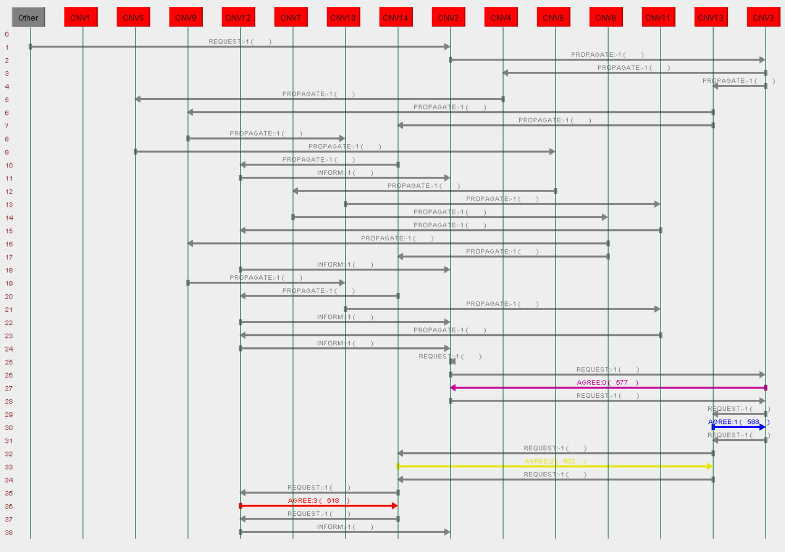
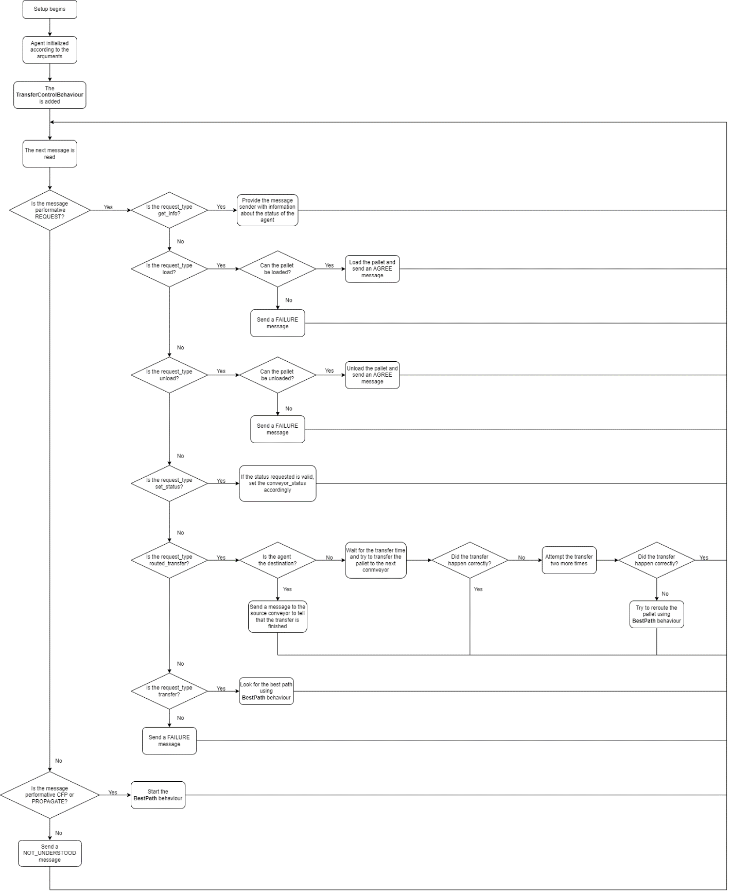
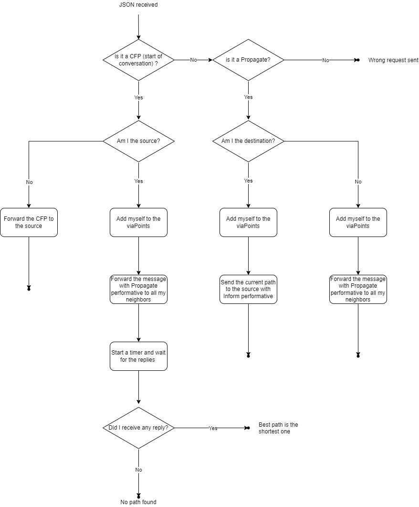

# Table of Contents

[Table of Contents [2](#table-of-contents)](#table-of-contents)

[Introduction [3](#introduction)](#introduction)

[Theoretical background
[4](#theoretical-background)](#theoretical-background)

[Weakness and strengths of our solution
[5](#weakness-and-strengths-of-our-solution)](#weakness-and-strengths-of-our-solution)

[Future work [6](#future-work)](#future-work)

[Inter-agents interactions
[7](#inter-agents-interactions)](#inter-agents-interactions)

[Conveyor agent logic [8](#conveyor-agent-logic)](#conveyor-agent-logic)

[Instructions to run and test our solution
[10](#instructions-to-run-and-test-our-solution)](#instructions-to-run-and-test-our-solution)

# Introduction

In this project, we are using the power of Multi Agent Systems to solve
a complex problem. Each agent is a conveyor. The entire system consists
of a network of conveyors with the goal of transferring the pallet from
one point to another. Since there is no global knowledge of the system,
and at any time a conveyor can be added, removed, or moved, Multi Agent
Systems are the only way to go.

We are combining both Task 1 -- transfer control -- and Task 2 -- path
finding algorithm: it is possible to send a request to a conveyor to
transfer a pallet to another conveyor. The path finding algorithm finds
the best path according to the number of conveyors involved. Then the
transfer control moves the pallet via the best path. If any of the
conveyors becomes "*busy*" or "*down*", the path finding algorithm is
run again to find another path.

# Theoretical background

The project is built on top of JADE technology: JADE is a Java framework
developed by Telecom Italia used for the development of Multi Agent
Systems. It also allows us to execute the agents into a simulation
environment with graphical tools to manage and monitor them. The
interaction between agents happens using the FIPA standard. All the
requests and CFPs are in JSON format in which the type of the request
and the arguments are specified.

# Weakness and strengths of our solution

Our solution is capable of handling more than one pallet per time. If
one conveyor is busy or down, the previous conveyor tries to send the
pallet three times after waiting some time. In this way we can handle
the situation of two pallets following different paths with one conveyor
in common. If after three tries the following conveyor is still
unavailable, the agent runs the path finding algorithm again. If a new
path is found, the pallet is sent through the new path.

This solution is very handy but does not distinguish between the *busy*
and the *down* state. By adding one more step of communication, it is
possible to try three times only if the next conveyor is busy and look
for new path from the beginning if the conveyor is down.

# Future work

An infinite number of functionalities can be added to the agents, and
some of the current can be improved or made more efficient. For example,
instead of trying three times to send the pallet after waiting a
definite amount of time, the conveyor could ask what the remaining time
is and wait for it.

Also, the path finding algorithm can be based on the total transfer time
and not the distance. With those improvements, the agent before a busy
conveyor could either decide to wait for it to become idle again or
follow another route if it is faster.

# Inter-agents interactions

{width="6.49583552055993in"
height="4.565277777777778in"}

On line 1, the request for transfer from CNV2 to CNV12 is sent to
CNV2[^1].\
On line 2, CNV2 starts to propagate the pathfinding request, that is
spread across all the conveyors involved. The paths found are
transmitted back to CNV2 as INFORM type, routed_transfer messages (line
11, 18, 22, 24).

Agent CNV2 chooses the best path and sends a routed_transfer REQUEST to
itself (line 25). Although this is not the most elegant solution, it is
very convenient since it requires almost no modification to the already
existing agent code and allows for an external user to step in in a
simple way.

The real transfer begins.\
For each step (there are four steps for this transfer), there is first a
load REQUEST (lines 26, 29, 32, and 35), that is followed by the AGREE
confirmation that the pallet has been correctly transferred. The last
REQUEST messages (lines 28, 31, 34, and 37) contain the routed_transfer
instruction.

On line 38, the destination conveyor (CNV12) sends an INFORM message to
the source conveyor (CNV2), saying that the transfer is completed.

# Conveyor agent logic

The logic of the ConveyorAgent can be represented using two flowcharts:
one for the TransferControl Behaviour and one for the BestPath behavior.

{width="6.443620953630796in"
height="7.84799978127734in"}

Figure 1: TransferControlBehaviour flowchart

{width="5.029343832020998in"
height="6.079656605424322in"}

Figure 2: BestPath flowchart

# Instructions to run and test our solution

The LayoutBuilderAgent will instantiate all the ConveyorAgents, which
take as arguments the neighbours and the transfer time. It is possible
to modify the default configuration of the system by changing the code
in the LayoutBuilderAgent class. To instantiate a new conveyor, the
lines to add are:

AgentController CNVx =
containerController.createNewAgent(\"CNVx\",\"agents.ConveyorAgent\",
new Object\[\]\[\]{ {\"CNVy\",\"CNVz\"}, {5}});

CNV1.start();

Where CNVx is the name of the conveyor to instantiate, CNVy and CNVz are
its neighbours, and 5 is the transfer time (in this case). The transfer
time is an integer value that stands for the number of seconds it takes
the conveyor to transfer the pallet.

The LayoutBuilderAgent will also start a Sniffer agent already sniffing
all the conveyors. If the names of the conveyors change, then the line
telling the sniffer which agents to sniff must change accordingly.

The Conveyor Agents are programmed to handle several types of commands,
sent as ACL messages.

  -----------------------------------------------------------------------------------
  **Performative**   **request_type**   **Attributes**      **Description**
  ------------------ ------------------ ------------------- -------------------------
  REQUEST            get_info                               Sends back a message
                                                            containing information
                                                            about the status of the
                                                            conveyor.

                     load                                   Loads the conveyor with a
                                                            pallet.

                     unload                                 Unloads the conveyor if
                                                            it is loaded.

                     set_status         status: {Idle,      Sets the status of the
                                        Busy, Down}         conveyor.

                     routed_transfer    source              Requests the transfer of
                                                            a pallet from the
                                                            *source* conveyor to the
                                                            *destination* conveyor,
                                                            through the conveyors
                                                            contained in the
                                                            *viaPoints* array. If the
                                                            *reroute* flag is set to
                                                            true, then the conveyors
                                                            will try to find
                                                            alternative routes if the
                                                            transfer fails.

                                        destination         

                                        viaPoints           

                                        reroute: {true,     
                                        false}              

                     transfer           source              Finds the best path from
                                                            the *source* conveyor to
                                                            the *destination*
                                                            conveyor and begins the
                                                            transfer. If one of the
                                                            conveyors on the path is
                                                            busy or down, the system
                                                            will try to attempt the
                                                            transfer three times
                                                            before searching for an
                                                            alternative path.

                                        destination         

  CFP                                   source              Tries to find the
                                                            shortest path from the
                                                            *source* conveyor to the
                                                            *destination* conveyor.

                                        destination         
  -----------------------------------------------------------------------------------

The content of the ACL message must be a JSON object containing the
fields as specified in the table. An example command can be found below.

{

    \"request_type\":\"transfer\",

    \"source\":\"CNV1\",

    \"destination\":\"CNV12\"

}

[^1]: The content of the message is shown in the example on page 11
